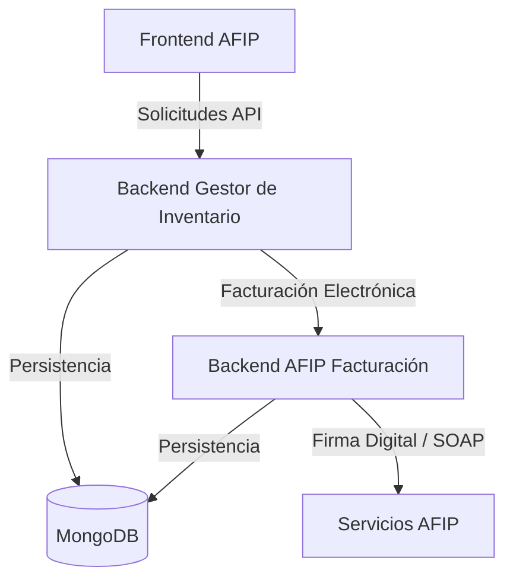

# 🚀 FacStock - Sistema de Gestión e Invoicing
** Panel Maestro **: Se creó una nueva página SuperAdminPanel.jsx accesible en la ruta /admin-maestro .
Este repositorio contiene los tres componentes principales del ecosistema FacStock, un ERP diseñado para la gestión de inventario y facturación electrónica en Argentina.

## 🏗️ Arquitectura del Sistema

El sistema sigue una arquitectura de microservicios (o servicios desacoplados) donde cada componente tiene una responsabilidad clara:

### 1. [Frontend AFIP](./frontend-afip/)
- **Tecnología**: React + Vite.
- **Responsabilidad**: Interfaz de usuario para la gestión de ventas, productos, clientes y configuración de empresa.
- **Puerto por defecto**: `5173`
- **Conexión**: Se comunica exclusivamente con el **Backend Gestor de Inventario**.

### 2. [Backend Gestor de Inventario](./backend-gestor%20de%20inventario/)
- **Tecnología**: Node.js + Express + Mongoose.
- **Responsabilidad**: Orquestador central. Maneja la lógica de negocio, autenticación, stock, cajas y ventas.
- **Puerto por defecto**: `3010` (configurado vía `.env`)
- **Conexión**: 
  - Consume **Backend AFIP Facturación** para procesos fiscales.
  - Persiste datos en **MongoDB**.

### 3. [Backend AFIP Facturación](./backend-afip-facturacion/)
- **Tecnología**: Node.js + Express + Mongoose.
- **Responsabilidad**: Especializado en la integración técnica con AFIP (WSAA, WSFE). Maneja certificados, tokens y generación de PDFs/QRs.
- **Puerto por defecto**: `3005` (configurado vía `.env`)
- **Conexión**: 
  - Recibe órdenes del **Backend Gestor de Inventario**.
  - Persiste datos en **MongoDB** (compartida).

---

## 🚦 Flujo de Comunicación

1. **Usuario interactúa con el Frontend**: Por ejemplo, hace clic en "Emitir Factura".
2. **Frontend llama al Gestor de Inventario**: Envía los datos de la venta.
3. **Gestor de Inventario procesa la venta**:
   - Valida stock.
   - Si es factura electrónica, delega al **Backend AFIP**.
4. **Backend AFIP procesa con AFIP**:
   - Obtiene Token de Acceso (si es necesario).
   - Envía el comprobante a los servidores de AFIP via SOAP.
   - Recibe el CAE.
   - Genera el PDF con el código QR.
5. **Respuesta final**: Los datos viajan de regreso al Gestor de Inventario y finalmente al Frontend para mostrar la factura al usuario.

---

## 🛠️ Configuración Rápida

Para poner en marcha el sistema completo localmente:

1. **Base de Datos**: Asegúrate de tener una instancia de MongoDB corriendo.
2. **Backend AFIP**:
   - `cd backend-afip-facturacion`
   - `npm install`
   - Configurar `.env` (Puerto 3005 sugerido)
   - `npm start`
3. **Backend Gestor de Inventario**:
   - `cd backend-gestor\ de\ inventario`
   - `npm install`
   - Configurar `.env` (Puerto 3010 sugerido, apuntar `BACKEND_AFIP_URL` al puerto 3005)
   - `npm start`
4. **Frontend**:
   - `cd frontend-afip`
   - `npm install`
   - Configurar `.env` (Apuntar `VITE_API_URL` al puerto 3010)
   - `npm run dev`

---

## 📚 Documentación Específica

Cada proyecto tiene su propio `README.md` con detalles técnicos, modelos de datos y endpoints específicos.

- [Documentación Frontend](./frontend-afip/README.md)
- [Documentación Gestor de Inventario](./backend-gestor%20de%20inventario/README.md)
- [Documentación Backend AFIP](./backend-afip-facturacion/readme.md)

---

**Desarrollado para FacStock - 2026**
