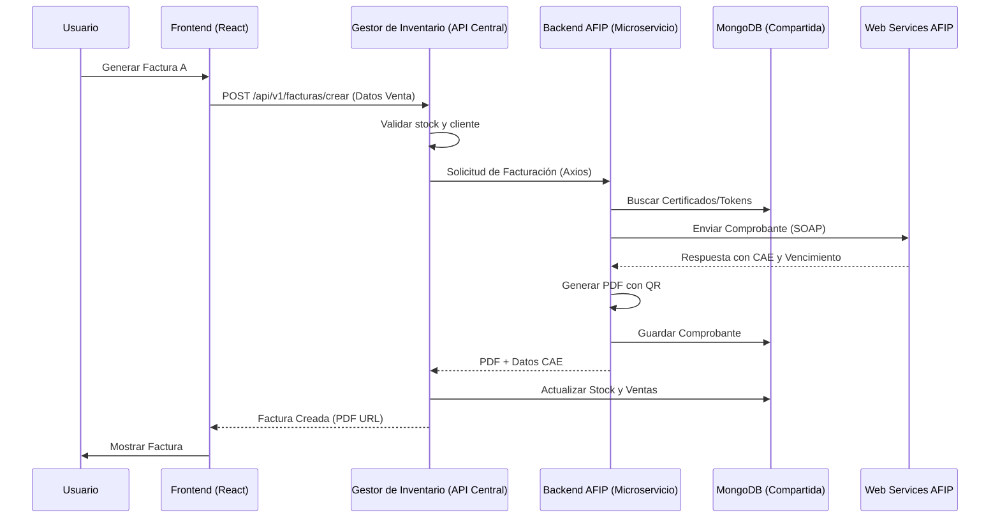

# 🧩 Arquitectura de Comunicación FacStock

Este documento detalla cómo interactúan los tres componentes del sistema: el Frontend, el Gestor de Inventario y el Microservicio de AFIP.

## 📡 Diagrama de Flujo de Datos

## 🛠️ Detalles de los Puertos y URLs

Para que el sistema funcione correctamente en desarrollo, se deben respetar las siguientes conexiones (configurables en archivos `.env`):

| Desde | Hacia | URL por Defecto | Variable de Entorno |
|-------|-------|-----------------|---------------------|
| Frontend | Gestor Inventario | `http://localhost:3010/api/v1` | `VITE_API_URL` |
| Gestor Inventario | Backend AFIP | `http://localhost:3005/api/` | `BACKEND_AFIP_URL` |
| Gestor Inventario | MongoDB | `mongodb://localhost:27017/facstock` | `MONGODB_URI` |
| Backend AFIP | MongoDB | `mongodb://localhost:27017/facstock` | `MONGODB_URI` |

## 📦 Responsabilidades por Componente

### 1. Frontend (`frontend-afip`)
- **Rol**: Presentación y validación de entrada del usuario.
- **Acceso**: Solo habla con el Gestor de Inventario. Nunca llama directamente al Backend de AFIP.

### 2. Gestor de Inventario (`backend-gestor de inventario`)
- **Rol**: Orquestador y guardián de la lógica de negocio.
- **Acceso**:
  - Controla la autenticación (JWT).
  - Gestiona el inventario, cajas, vendedores y clientes.
  - Decide cuándo una venta es "Interna" (Ticket) o "Fiscal" (Factura AFIP).
  - Si es fiscal, prepara el payload para el Backend AFIP.

### 3. Backend AFIP (`backend-afip-facturacion`)
- **Rol**: Especialista técnico en AFIP.
- **Acceso**:
  - Encapsula toda la complejidad de SOAP y firma digital.
  - Gestiona el ciclo de vida de los tokens de acceso (WSAA).
  - Proporciona endpoints simplificados para que el orquestador no necesite saber de XML o SOAP.
  - Genera archivos físicos (PDFs) y QRs.

## 🔐 Seguridad y Autenticación

- El **Frontend** utiliza un token JWT obtenido del Gestor de Inventario.
- La comunicación entre el **Gestor de Inventario** y el **Backend AFIP** es interna. Se recomienda que el Backend AFIP no sea accesible desde el exterior (firewall).

---
**Última revisión**: Mayo 2026
